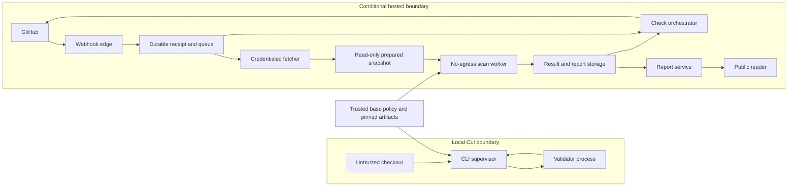

# Initial threat model

- **Status:** Proposed P0 security baseline
- **Date:** 2026-07-30
- **Owner:** Phase 0 co-maintainers (`@back1ash`, `@Seo-yul`, and
  `@minsubyun1`)
- **Issue:** [#8](https://github.com/SpecArgus/PROOF/issues/8)
- **Applies to:** the local CLI and any future PROOF-managed GitHub App,
  scan worker, and public report service

This document defines the minimum security boundary for processing untrusted
OpenAPI documents and GitHub events. It is normative for P0 design and
implementation. A control described as a hosted launch gate must be implemented
and verified before the Phase 0 hosted-product go decision can be `go`.

PROOF performs deterministic static contract analysis. It does not execute an
agent or API, and a passing result does not prove that an API implementation,
authorization system, confirmation flow, or runtime is safe.

## Scope and assumptions

The threat model covers:

- OpenAPI 3.0.x and 3.1.x JSON and YAML supplied from a local checkout, base
  repository, or pull request;
- repository-local `$ref` discovery and validation;
- the validator subprocess and its supervisor;
- GitHub webhooks, installation tokens, repository metadata, pull requests,
  Check Runs, retries, and duplicate delivery;
- normalized results, public web reports, logs, caches, and deletion; and
- dependency, rule-pack, configuration, and release artifact integrity.

The following are outside the P0 product boundary:

- remote URL input and remote `$ref`;
- private-repository scanning and private reports;
- repository-provided executable rules, plugins, hooks, workflows, or build
  scripts;
- execution of an API, MCP server, agent, generated code, or repository code;
  and
- a claim that the local CLI is an operating-system security sandbox.

All specification bytes, filenames, paths, references, repository metadata,
GitHub event fields, configuration, diagnostics, and report fields are
untrusted. The trusted computing base includes the pinned PROOF release,
locked runtime and dependencies, trusted-base policy, GitHub webhook secret,
installation credentials, hosted isolation controls, and report authorization
logic.

## Assets and security objectives

| Asset | Security objective |
| --- | --- |
| GitHub webhook secrets and installation tokens | Never expose them to repository content, the validator, results, reports, or logs. Use only the minimum permissions and lifetime. |
| Trusted base configuration and rule-pack identity | A pull request cannot weaken the gate that evaluates itself. Every result records the effective configuration and artifact digests. |
| Repository and specification content | Read only the intended immutable revision, never escape its canonical root, and delete transient hosted input after the job. |
| Check Run and result integrity | Bind every outcome to the repository, pull request, base, head, test-merge revision, policy, and artifact identities that produced it. |
| Service and developer-machine availability | Bound parser, resolver, validator, output, queue, and retry work; never turn incomplete analysis into success. |
| Report confidentiality and integrity | Serve reports only under the current repository visibility policy, render untrusted content as data, retain it for the declared period, and delete it predictably. |
| Release and dependency integrity | Build from pinned inputs, verify artifacts and provenance, and make upgrades pass the full security and determinism suites. |

## Actors and capabilities

| Actor | Assumed capabilities |
| --- | --- |
| External contributor | Controls fork and head-branch files, filenames, OpenAPI and configuration content, commit history, and pull-request text. May intentionally create parser, resolver, rendering, and resource-exhaustion payloads. |
| Repository maintainer | Controls trusted base policy, repository enrollment, required checks, merge decisions, and report deletion requests. A compromised maintainer account is outside the application boundary but must be constrained by GitHub controls and audit records. |
| Unauthenticated report reader | Can request or enumerate public report URLs and send arbitrary request metadata. Must never receive a non-public or tombstoned report. |
| GitHub | Delivers events and issues scoped installation tokens. Network delivery can be delayed, duplicated, reordered, replayed, or unavailable. |
| PROOF service operator | Operates secrets, queues, workers, storage, and releases. Operator access is privileged and must be auditable and least-privileged. |
| Dependency or build attacker | Attempts to compromise a package, build action, release artifact, or mutable dependency resolution. |
| Local CLI user and host | Chooses which checkout to scan and controls the host environment. The CLI protects against accidental and malicious input effects but cannot protect a compromised host from itself. |

## Data flow and trust boundaries

The principal trust boundaries are:

1. **Untrusted input to analysis.** The CLI supervisor or hosted fetcher
   admits bytes and paths only after applying limits and repository
   containment.
2. **Supervisor to validator.** The validator receives a versioned request and
   a closed in-memory resource set. Standard output is protocol-only.
3. **GitHub to hosted control plane.** The webhook edge authenticates the raw
   body before parsing or durable enqueue.
4. **Credentialed fetcher to isolated worker.** The fetcher owns the
   installation token. The worker receives only a read-only snapshot, bounded
   request data, trusted policy, and pinned artifacts.
5. **Analysis to reporting.** Normalized results are validated before storage.
   Reporters escape untrusted values and cannot change the analysis result.
6. **Report storage to reader.** Current repository visibility, installation
   state, tombstone state, and retention determine whether content is served.

## Mandatory input and execution limits

Limits are inclusive: an input exactly at a limit is accepted, while the next
byte, file, level, alias, diagnostic, or millisecond is rejected or terminated.
Byte limits are measured on raw bytes before text decoding. Every admitted path
must match the repository entry's exact casing at each segment. That makes path
identity consistent on case-sensitive and case-insensitive hosts; a mismatched
spelling is an input error rather than a second resource. Each exact-case
normalized path is charged once to a reference closure.

| Control | P0 limit | Required behavior |
| --- | ---: | --- |
| Entrypoint size | 10,000,000 bytes | Reject before parsing when exceeded. |
| Aggregate reference-closure size | 20 MiB (20,971,520 bytes) | Stop before reading a file that would exceed the budget. |
| Exact-case repository files in one closure | 100 | Count the entrypoint and each distinct exact-case normalized referenced path. |
| External-reference depth | 32 | Reject the reference that would enter depth 33. Legitimate cycles terminate through exact-case normalized-path tracking. |
| Parsed document nesting | 100 levels | Reject deeper JSON or YAML before semantic validation. |
| YAML alias references | 50 | Reject cycles and a 51st alias before expanding an attacker-controlled graph. |
| Emitted diagnostics | 100 | Sort and deduplicate deterministically, retain the first 100, and report truncation. |
| Observed validator diagnostics | 2,048 | Stop iteration and fail visibly when observation reaches the cap; never call a partial result complete. |
| Validator wall time | 5 seconds | Terminate the complete process tree and return an internal error. |
| Captured standard output and error | 1 MiB combined | Terminate the process tree on overflow. Standard output must contain exactly one valid protocol message. |

The supervisor must apply a cumulative job budget when one command names
multiple entrypoints. The exact entrypoint-count and whole-job wall-time caps
remain an implementation decision and are tracked as an open risk below; no
implementation may multiply the per-entrypoint limits without a finite
cumulative ceiling.

Remote references, protocol-relative references, `file:` URIs, absolute paths,
Windows drive or device paths, UNC paths, parent traversal, percent-encoded
traversal, and canonical link or junction escapes are denied. URI decoding and
canonicalization occur before containment checks. Files must be regular files
inside the immutable repository snapshot.

Only strict UTF-8 JSON or YAML is accepted. The preflight parser rejects
duplicate keys, multiple YAML documents, non-JSON YAML values, and recursive
aliases. Before schema validation, the validator worker rejects an unsupported
OpenAPI dialect with the stable `input.unsupported-dialect` diagnostic, and the
normalizer leaves the operation set `indeterminate`. The parser does not run
YAML constructors, repository code, plugins, package installation hooks,
templates, or shell commands.

## Hosted isolation launch gates

The local process boundary improves fault isolation but is not a complete
sandbox. A PROOF-managed worker may launch only when its platform enforces all
of the following outside the Python process:

| Resource | Initial hosted ceiling |
| --- | ---: |
| CPU | 1 vCPU per active job |
| Memory | 512 MiB per active job |
| Process tree | 4 processes, with no surviving descendants |
| Writable ephemeral storage | 128 MiB |
| Open file descriptors or handles | 64 |
| Network | No ingress and no egress from the scan worker |
| Repository filesystem | Read-only prepared snapshot; no host or sibling-job mounts |
| Validator time and output | The limits in the preceding table |

The worker runs as an unprivileged identity with a minimal environment and no
cloud, GitHub, queue, database, object-store, or report credentials. It cannot
choose the result destination. Temporary workspaces are unique per attempt,
not shared between repositories, and are destroyed after the terminal result
or forced termination.

Increasing a ceiling requires security review because it increases the
attacker's available resources. Decreasing a ceiling requires compatibility
review and exact-boundary fixtures.

## GitHub event and credential policy

The initial GitHub App requests only:

- Checks: read and write;
- Contents: read-only;
- Pull requests: read-only; and
- Metadata: read.

Contents write, Issues write, Pull requests write, Administration write, and
Actions write are outside the product permission set.

The webhook edge verifies the raw request body with the configured HMAC
algorithm and a constant-time comparison before parsing any untrusted JSON.
Invalid signatures and oversized or malformed payloads are rejected without
creating a run. `X-GitHub-Delivery` is stored as a unique durable receipt.
Redelivery checks the original enqueue outcome and cannot create duplicate
logical work.

Installation tokens are requested by the fetcher for one fetch operation,
held in memory, and discarded as soon as the immutable reference closure is
prepared. PROOF does not persist or log them, place them in command lines,
include them in URLs, pass them to the worker, or return them in diagnostics.
Use stops after the fetch even when the provider token remains valid; the
provider lifetime may not exceed one hour. Secrets are stored in the platform
secret manager, redacted by exact-value and credential-pattern filters, and
rotated with an audited overlap procedure.

The logical scan identity includes immutable repository and pull-request IDs,
base SHA, head SHA, test-merge SHA, transitive input digest, effective-policy
digest, and engine, validator, and rule-pack artifact digests. A delivery ID is
not a scan identity. Rerequests create a new attempt and Check Run while
preserving the exact evaluation inputs required by the result contract.

Trusted policy is loaded from the base revision. A pull request may add scope
or make policy stricter, but it cannot remove base scope, lower severity, relax
`failOn`, or replace pinned artifacts for the Check that evaluates that pull
request.

## Report, rendering, and deletion policy

P0 hosted reports are available only for repositories that are currently
public and enrolled. A report is keyed by immutable repository, installation,
run, and attempt identities rather than repository names. Visibility or
installation state that cannot be confirmed fails closed.

Report values are always rendered as text or typed data. The service does not
render specification-provided HTML, Markdown, scripts, data URLs, remote
images, or active SVG. It applies contextual escaping, a restrictive Content
Security Policy, MIME-type and `nosniff` headers, and safe download
dispositions. Normalized paths are repository-relative and reports exclude
host paths, environment variables, credentials, request headers, and raw
service errors.

The initial lifecycle is:

| Data | Retention and deletion |
| --- | --- |
| Prepared repository snapshot and raw specification input | Destroy after the attempt reaches a terminal state or is forcibly terminated. Do not place it in backups. |
| Public report body, findings, and evidence | Retain for 30 days after terminal completion. The URL is immutable during that period. |
| Minimal audit metadata | Retain for 90 days. It may include immutable IDs, digests, state, and timestamps, but not specification content, finding evidence, tokens, or worker output. |
| Visibility change, repository deletion or transfer, or App uninstall | Tombstone immediately, purge serving caches, and deny report content. A transfer remains denied until the new ownership and installation are explicitly authorized. |
| Primary content after tombstone or deletion request | Hard-delete within 24 hours while continuing to serve no content. |
| Backup copies of deleted report content | Expire within 30 days and cannot be restored to the serving path without a fresh authorization review. |

Repository renames do not change identity. A public-to-private transition,
deletion, transfer, suspension, or uninstall event invalidates every affected
cache entry. Reconciliation covers missed events. A lookup error never falls
back to stale public content.

## Threat register

Priority combines product urgency and likely security impact. Every P0 threat
is a release blocker until its required controls and verification exist.

| ID | Threat and impact | Priority | Mandatory controls | Verification | Residual risk |
| --- | --- | --- | --- | --- | --- |
| TM-01 | Malformed JSON or YAML exploits a parser bug or causes excessive CPU or memory use, leading to code execution or denial of service. | P0 / Critical | Strict UTF-8 preflight, no custom constructors, nesting and byte limits, isolated validator, hosted CPU and memory ceilings. | Malformed, invalid UTF-8, duplicate-key, multi-document, deep-nesting, fuzz, and dependency-regression suites on every supported OS. | Unknown parser vulnerabilities remain possible; hosted isolation and rapid dependency response limit impact. |
| TM-02 | Cyclic or amplifying YAML aliases create an expanded object graph much larger than the input. | P0 / High | Reject recursive aliases, cap alias references at 50 before expansion, cap nesting and worker memory. | Exact 50/51 boundaries, recursive-cycle fixtures, alias-amplification fixtures, and memory-kill verification. | Small acyclic amplification below the limits can still be expensive. |
| TM-03 | A direct or transitive `$ref` causes SSRF, local-file disclosure, or unintended network egress. | P0 / Critical | Deny all remote and `file:` schemes, build a closed local resource allowlist, omit network handlers, run hosted validation with no egress. | Direct and transitive loopback canaries must observe zero requests; scheme and protocol-relative corpus. | Local CLI network denial is best-effort, so resolver denial remains the primary control there. |
| TM-04 | Traversal, encoding, symlink, junction, race, or path-confusion reads outside the intended repository. | P0 / Critical | Decode then canonicalize, require immutable root containment and regular files, use bounded descriptors, read from a prepared hosted snapshot. | Parent, encoded, absolute, drive, device, UNC, symlink, junction, and concurrent-mutation tests across supported platforms. | Local files can change concurrently; the CLI records content digests and fails when acquisition is inconsistent. |
| TM-05 | Repository code, workflow, plugin, or dependency hook executes with service credentials. | P0 / Critical | Never run repository code or install repository dependencies; worker has no credentials or egress; rule packs are pinned PROOF artifacts. | Canary executables and install hooks must not run; credential-absence and syscall or sandbox policy tests. | A vulnerability in the pinned analysis runtime could still execute inside the worker sandbox. |
| TM-06 | A diagnostic or metadata value injects HTML, Markdown, terminal escapes, logs, paths, or secrets into output. | P0 / High | The validator worker neutralizes C0 and DEL characters in diagnostic messages before the protocol boundary, and the supervisor rejects a response if those characters remain. Reporters contextually escape every other untrusted string and never derive ANSI control sequences from input. Active content is disabled; logs and output are bounded; secrets are redacted. | Worker normalization and supervisor-rejection tests plus XSS, Markdown, ANSI, newline, path, credential-pattern, MIME-sniffing, and CSP browser tests. | Public specification text deliberately appears as escaped report evidence during retention. |
| TM-07 | A forged, replayed, oversized, duplicated, or reordered webhook creates unauthorized or inconsistent work. | P0 / High | Raw-body HMAC before parsing, payload limit, unique durable delivery receipt, transactional enqueue, idempotent logical scan key. | Invalid and rotated secrets, byte mutation, replay, redelivery, out-of-order, and enqueue-crash integration tests. | A valid delayed event can arrive after newer work; immutable identity and stale-result handling prevent reuse as current success. |
| TM-08 | An installation token or service secret is exposed to a fork, worker, log, URL, report, or sibling job. | P0 / Critical | Minimum App permissions, fetcher-only memory use, no command-line or URL token, redaction, isolated jobs, audited secret rotation. | Permission snapshot regression, token canaries, environment and process inspection, log scanning, and fork tests. | GitHub and authorized operators remain privileged trust dependencies. |
| TM-09 | Head-branch configuration weakens policy, or content from one repository or pull request affects another. | P0 / Critical | Trusted base policy with monotonic head changes, immutable repository and PR IDs, per-attempt workspace, no cross-job cache of untrusted content. | Policy-removal and threshold-lowering fixtures, repository transfer, same-head multiple-PR, and parallel isolation tests. | A compromised trusted base or maintainer can change future policy through normal reviewed governance. |
| TM-10 | Duplicate delivery, retry, base update, rerequest, or stale completion binds the wrong success to a required check. | P0 / High | Full logical scan identity, distinct attempt IDs, compare-and-set terminalization, bounded retry, watchdog, and open-PR reconciliation. | Duplicate and concurrent events, base movement, stale completion, timeout recovery, and same-head multiple-PR tests. | GitHub outage can delay a terminal Check; it must remain visibly pending or error, never silently pass. |
| TM-11 | A report remains visible after a repository becomes private, is deleted or transferred, or uninstalls the App. | P0 / Critical | Current visibility and installation check, fail closed, immediate tombstone and cache purge, event reconciliation, immutable IDs, declared deletion deadlines. | Public/private/public, uninstall, transfer, rename, delete, missed-event, cache, backup-expiry, and authorization-outage tests. | Event and reconciliation delay can briefly reduce availability; stale content is denied during uncertainty. |
| TM-12 | Mutable dependencies, actions, runtime drift, or artifact substitution changes findings or compromises builds. | P0 / High | Exact locks and action SHAs, clean builds, SBOM, vulnerability review, content digests, signed provenance, no implicit upgrades. | Lockfile rejection, artifact digest mismatch, reproducible build, SBOM, vulnerability, and full validator corpus on upgrades. | Signed and pinned software can contain unknown vulnerabilities. |
| TM-13 | The local CLI is mistaken for a complete sandbox, exposing a developer machine to residual parser or runtime flaws. | P0 / High | Document the boundary, deny remote refs and code, supervise the validator, apply portable limits, exclude credentials from the child environment. | Windows, Linux, and macOS process-tree, timeout, output, path, and environment tests. | CPU, memory, filesystem, and network isolation are best-effort on a user-controlled host; this is accepted only for an explicit local scan. |
| TM-14 | Resource limits themselves are bypassed or multiplied across many entrypoints, retries, or concurrent jobs. | P0 / High | Raw-byte accounting, exact-case normalized-path charging, finite cumulative job and tenant budgets, bounded retries and concurrency, hosted resource quotas. | Exact inclusive boundaries, wrong-case aliases, many-entrypoint, retry-storm, queue-backpressure, and concurrent-tenant load tests. | Multi-entrypoint and service concurrency values remain open until their implementation issues, and block the relevant release until fixed. |
| TM-15 | Static metadata findings are presented as runtime security enforcement, causing unsafe reliance on a pass. | P0 / High | Every interface states the static-analysis boundary; findings use evidence and recommendations; no “safe API” claim or opaque safety score. | Snapshot and usability tests verify pass, blocked, advisory, input-error, and internal-error wording. | Users can still ignore the limitation; documentation and conservative product language reduce but cannot eliminate misuse. |

## Visible failure behavior

No failure mode may produce `pass`, reuse an unrelated Check, or leave a
durably accepted run pending indefinitely.

| Condition | Normalized behavior | CLI | Hosted behavior |
| --- | --- | ---: | --- |
| OpenAPI structural or semantic violation fully evaluated | `completed` with normalized validator findings; gate is `blocked`, `advisory`, or `pass` according to policy | `0` or `1` | Terminal Check with matching conclusion and immutable report |
| Invalid UTF-8, malformed JSON/YAML, duplicate key, unsupported dialect, forbidden reference, path escape, or an input limit | `input-error`, gate `not-evaluated`, stable error code and safe location when available | `2` | Terminal error Check and setup/input report |
| Diagnostic observation limit | `input-error`, gate `not-evaluated`; report retained and truncated counts, but do not claim full findings | `2` | Terminal error Check |
| Timeout, process crash, output overflow, malformed worker protocol, dependency failure, sandbox kill, or storage integrity failure | `internal-error`, gate `not-evaluated` | `3` | Terminal error Check; bounded retry only when identity and idempotency are preserved |
| Invalid webhook signature or payload rejected before durable acceptance | No analysis result | Not applicable | Reject request and create no Check or report |
| Visibility or installation cannot be confirmed | No report content is served | Not applicable | Fail closed with a tombstoned or not-found response |

The validator worker's transport-level `invalid` outcome means that it emitted
a controlled diagnostic; it is not a normalized run status. For an unsupported
dialect the worker must emit `input.unsupported-dialect` without invoking a
dialect validator, while normalization must remain `indeterminate`. The run
assembler in issue [#24](https://github.com/SpecArgus/PROOF/issues/24) must map
that pair to `input-error` and `not-evaluated`, never to a completed run.

Public messages contain no stack trace, absolute path, secret, raw request
header, or mutable infrastructure identifier. Operators may correlate a safe
opaque error ID with access-controlled logs.

## Required security verification

Before the local CLI alpha:

- run strict parser, alias, nesting, reference, path, link, limit, cycle,
  diagnostic-flood, timeout, process-tree, output, and deterministic-result
  tests on Windows x64, Linux x64, and macOS arm64;
- fuzz JSON/YAML preflight and reference discovery with a bounded, reproducible
  corpus;
- confirm child environments contain no host credentials and normalized
  results contain no host paths or secrets; and
- require the complete validator corpus, locked dependency installation, SBOM,
  and vulnerability review for every parser or validator upgrade.

Before a hosted-product `go` decision:

- demonstrate hard no-egress, read-only filesystem, memory, CPU, process,
  descriptor, storage, output, and time enforcement from outside the worker;
- complete the public-fork matrix in issue
  [#7](https://github.com/SpecArgus/PROOF/issues/7), including unreadable heads,
  first-time contributors, deleted branches, and identical heads on different
  pull requests;
- test webhook authenticity, replay, ordering, transactional enqueue, retry,
  watchdog, and reconciliation failure modes;
- prove the worker receives no GitHub or service credentials and cannot select
  a report or Check destination;
- pass rendering and browser tests for XSS, active content, CSP, MIME handling,
  cache behavior, and JSON download;
- exercise public-to-private, uninstall, transfer, rename, delete, provider
  outage, tombstone, primary deletion, and backup-expiry transitions; and
- conduct a Phase 0 co-maintainer review of this document and every accepted
  residual risk under the material-decision rule in
  [ADR 0002](../adr/0002-product-identity-and-phase-0-governance.md).

Security tests are release gates, not optional monitoring. A platform that
cannot enforce or pass a required control is unsupported until a separate
review narrows the product scope.

## Accepted residual risks

The Phase 0 co-maintainers accept only the following residual risks at this
stage:

1. **Local host isolation is best-effort.** A user explicitly invoking the CLI
   accepts that the host OS may not enforce no-egress, CPU, and memory controls
   as strongly as the hosted worker. The parser and resolver policies still
   apply.
2. **Static analysis has a bounded claim.** A pass means only that the pinned
   static contract checks completed under the effective policy. It does not
   establish runtime API safety.
3. **Unknown dependency vulnerabilities remain possible.** Pinning, inventory,
   isolation, upgrade tests, and vulnerability response reduce but do not
   eliminate supply-chain risk.
4. **Escaped evidence from a public specification is public for 30 days.**
   P0 scans only currently public repositories, minimizes stored content, and
   applies immediate tombstoning when that condition changes.

No residual risk permits a hosted launch without hard worker isolation,
credential separation, current-visibility enforcement, or terminal failure
behavior. Any new material residual risk requires recorded agreement under the
material-decision rule in an issue or ADR.

## Open risks, owners, and review points

| Open risk or decision | Owner | Mandatory review point |
| --- | --- | --- |
| Maximum entrypoints per command, cumulative whole-job time, and service concurrency or tenant quotas | Core and service maintainers (Phase 0 co-maintainers) | Before the CLI implementation accepts multiple entrypoints; service quotas before hosted `go` |
| Concrete hosted sandbox technology and proof that every initial ceiling is externally enforced | Hosted service maintainers (Phase 0 co-maintainers) | Phase 0 hosted-product go/no-go |
| Public-fork fetch and Check attachment behavior | Issue #7 owner and maintainers | Before public-fork support is advertised or hosted `go` |
| Operational evidence for 24-hour primary deletion, 30-day backup expiry, and 90-day audit-metadata deletion | Hosted service maintainers (Phase 0 co-maintainers) | Before storing the first hosted report |
| Parser, validator, and locked dependency vulnerability changes | Phase 0 co-maintainers | Every dependency upgrade and every release |
| Private-repository authorization, encryption, and retention | Future private-repository feature owner | Before any private repository is enrolled; not covered by this P0 acceptance |

Review points are event-based rather than calendar-based. This threat model
must also be reviewed when the supported dialects, input sources, rule
execution model, GitHub permissions, result schema, public/private scope,
retention, or worker isolation boundary changes.
